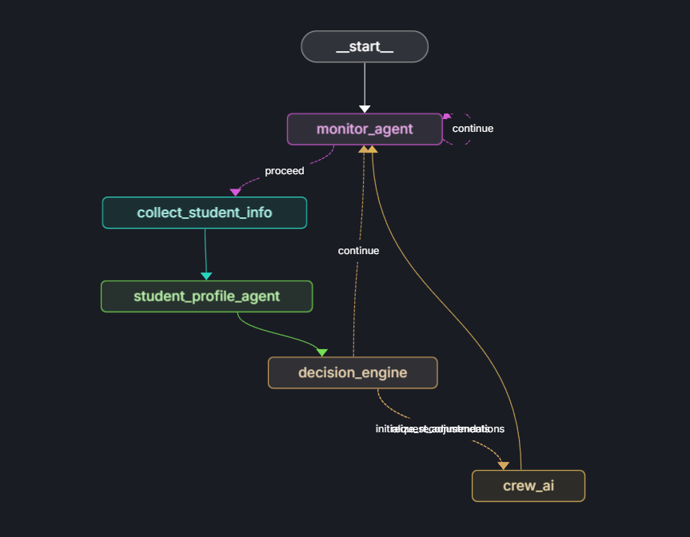
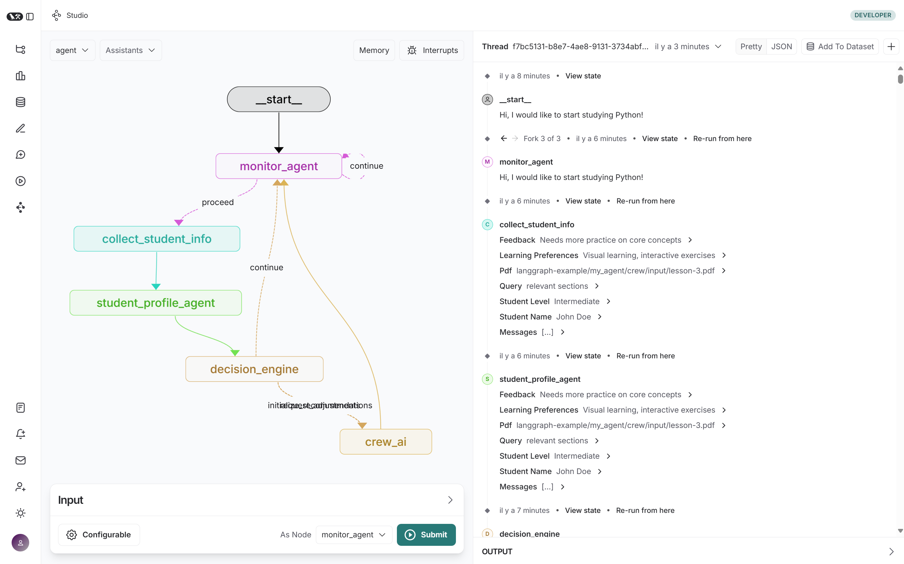

# ALIA-PAL: Agents Intelligents pour l'Apprentissage Personnalisé





ALIA-PAL is an innovative educational framework that leverages artificial intelligence to provide personalized and adaptive learning experiences. The system combines LangGraph's decision-making capabilities with CrewAI's multi-agent architecture to create a dynamic learning environment that continuously adapts to student needs.

## Key Features

- Dynamic scaffolding adaptation based on real-time student performance
- Multi-agent system for specialized educational tasks
- Integration with teacher-provided materials through RAG
- Real-time monitoring and adjustment of learning paths
- Structured human-in-the-loop validation process

## Architecture

The system uses LangGraph as its core decision-making engine while implementing specialized educational agents through CrewAI. This dual-layer approach enables both high-level learning strategy orchestration and granular pedagogical interventions.

## Getting Started

### Prerequisites

- Python 3.11
- LangGraph Cloud account
- OpenAI API key

### Installation

1. Clone the repository:
```bash
git clone https://github.com/RedPill47/ALIA-PAL.git
```

2. Navigate to the project directory and launch LangGraph Cloud:
```bash
cd ALIA-PAL
langgraph dev
```

This will start the LangGraph Cloud server. You can access the Studio UI through the provided link:
🎨 Studio UI: https://smith.langchain.com/studio/?baseUrl=http://127.0.0.1:2024

### Configuration

1. In the Studio UI, locate the Configurable section
2. Set the Model Name to "openai"

### Using the Chatbot

1. Click the + Message button in the interface
2. Type your query
3. Click Submit
4. Watch the graph execution on the left panel
5. View the conversation thread on the right panel
